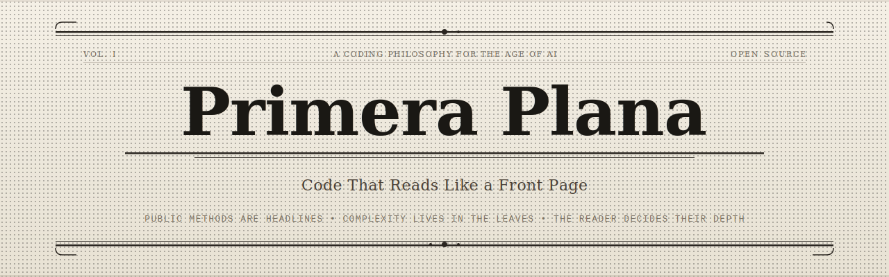

<p align="center">
  
</p>

<p align="center">
  <strong>A coding philosophy where public methods are headlines and complexity lives in the leaves.</strong>
</p>

<p align="center">
  <a href="https://tomacco.github.io/primera-plana/presentation/">
    
  </a>
  <a href="#install">
    
  </a>
  <a href="philosophy.md">
    
  </a>
  <a href="guides/">
    
  </a>
</p>

---

## The Problem

AI changed who writes code. It didn't change who reads it.

Teams are reviewing 300+ pull requests per month — nearly half AI-assisted. Writing got 10x faster. Reading didn't get 1% faster. **The reader became the constraint.**

Primera Plana is a response to that shift. It's a philosophy for writing code that respects the reader's time above all else.

## The Insight

Since the 1860s, journalists have used the **inverted pyramid**: most important information first, then supporting details, then background. The reader decides how deep to go.

```
 ┌─────────────────────────────────┐
 │  PUBLIC METHOD (the headline)   │  ← Read this: you know the full story
 ├─────────────────────────────────┤
 │  PRIVATE METHODS (paragraphs)   │  ← Read these: you understand each step
 ├─────────────────────────────────┤
 │  LEAVES (implementation)        │  ← Read these: you see every detail
 └─────────────────────────────────┘
```

A reviewer reading only the headline knows *what* happens. Reading paragraphs reveals *how*. Only when debugging do you reach the leaves.

## The Three Rules

**1. Headlines are short** — Your public method is a sequence of named steps. 5-10 lines. No conditionals, no loops, no error handling plumbing.

**2. Name the steps** — Method names describe WHAT happens, not HOW. `validateInventory()` not `checkIfItemsExistInWarehouseAndAreNotReserved()`.

**3. Complexity in the leaves** — Push all implementation detail to private methods. The trunk stays clean. Flatmap chains, retry logic, object construction — all in the leaves.

---

<h2 id="install">Install</h2>

One command. Auto-detects your AI tool. Always-on — no manual invocation needed.

```bash
curl -fsSL https://raw.githubusercontent.com/tomacco/primera-plana/main/install/install.sh | bash
```

<details>
<summary><strong>Choose a language</strong></summary>

```bash
# Default is Kotlin. Pick yours:
curl -fsSL https://raw.githubusercontent.com/tomacco/primera-plana/main/install/install.sh | bash -s -- kotlin
curl -fsSL https://raw.githubusercontent.com/tomacco/primera-plana/main/install/install.sh | bash -s -- typescript
curl -fsSL https://raw.githubusercontent.com/tomacco/primera-plana/main/install/install.sh | bash -s -- python
curl -fsSL https://raw.githubusercontent.com/tomacco/primera-plana/main/install/install.sh | bash -s -- swift
curl -fsSL https://raw.githubusercontent.com/tomacco/primera-plana/main/install/install.sh | bash -s -- java
```

</details>

<details>
<summary><strong>Supported tools</strong></summary>

| Tool | How it works |
|------|-------------|
| **Claude Code** | Installs as always-on coding standards in `~/.claude/` |
| **OpenAI Codex** | Places `PRIMERA_PLANA.md` referenced from `AGENTS.md` |
| **GitHub Copilot** | Writes to `.github/copilot-instructions.md` |
| **Cursor** | Writes to `.cursorrules` |
| **Windsurf** | Writes to `.windsurfrules` |
| **Cline** | Writes to `.clinerules` |

The agent doesn't need to be told to use it. It just does.

</details>

---

## Guides

Language-specific guides with full examples, idioms, and patterns:

| Language | Guide | Ecosystem |
|----------|-------|-----------|
| Kotlin | [`guides/kotlin.md`](guides/kotlin.md) | Backend, Android, Arrow/Either |
| Python | [`guides/python.md`](guides/python.md) | Backend, ML, structlog/returns |
| TypeScript | [`guides/typescript.md`](guides/typescript.md) | Full-stack, React, neverthrow |
| Swift | [`guides/swift.md`](guides/swift.md) | iOS, macOS, Result types |

## Quick Example

```kotlin
// The headline — a reviewer reads this and knows the full behavior
fun execute(request: PlaceOrderRequest) {
    val subscription = resolveSubscription(request) ?: return
    val roast = resolveAvailableRoast(subscription) ?: return
    val payment = processPayment(subscription, roast) ?: return

    saveOrder(subscription, roast, payment)
}
```

Five lines. Five named steps. The full story on the front page.

---

## Philosophy

Primera Plana is language-agnostic but idiom-specific. The philosophy is universal — the implementation is native to each language.

Read the full philosophy: **[philosophy.md](philosophy.md)**

---

## The Foundation Principle

> **The reader's time is more expensive than the writer's.**

Every decision in Primera Plana flows from this. More methods? Yes — if it makes the headline clearer. More indirection? Yes — if each layer is self-contained. More lines of code? Yes — if each line carries exactly one idea.

Writing is a one-time cost. Reading is a recurring cost paid by every reviewer, every debugger, every future maintainer. Optimize for the recurring cost.

---

<p align="center">
  <sub>Primera Plana is open source. Contributions welcome — especially language guides and real-world before/after examples.</sub>
</p>
